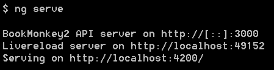

# book-monkey2-api
[![NPM version][npm-image]][npm-url]


REST Server Backend for the [BookMonkey2](https://github.com/angular-buch/book-monkey2) demo.  
A publicly available server is hosted at [book-monkey2-api.angular-buch.com](http://book-monkey2-api.angular-buch.com/), which always serves the latest version (#master).  
The API is fully described via swagger. Explore it [here](http://book-monkey2-api.angular-buch.com/swagger-ui/#/book).

# The book

[](https://angular-buch.com/)

This backend is used to explain HTTP communication with Angular 2.  
Read more about Angular 2 in our book. Visit [angular-buch.com](https://angular-buch.com/) for more information (German only).

# Usage

The server is written on top of [restify](http://restify.com/). It provides simple CRUD operations over books.  
The data is stored in memory only. Eveything will be lost on restart or when `DELETE /books` is called.

## Shared server

A publicly available server is hosted at [book-monkey2-api.angular-buch.com](http://book-monkey2-api.angular-buch.com/).  
Feel free to use it as your test-drive. __Data will be erased periodically.__

## Development

You might want to extend or modify the project.  
Execute the following commands to start the standalone-server:

```
git clone https://github.com/Angular2Buch/book-monkey2-api.git
cd book-monkey2-api
npm install
npm start
```

Open __http://localhost:3000/__ in your brower.

## Angular-CLI

This package is a [ember-cli](http://ember-cli.com/) / [angular-cli](https://github.com/angular/angular-cli) addon, too.  
Add it to the `node_modules` folder and it will be automatically available as a new command.

```
cd <your-angular-cli-project>
npm install book-monkey2-api --save-dev
ng monkey
```

<!---->


# License
Code released under the [MIT license](https://opensource.org/licenses/MIT).

[npm-url]: https://npmjs.org/package/book-monkey2-api
[npm-image]: https://badge.fury.io/js/book-monkey2-api.svg
